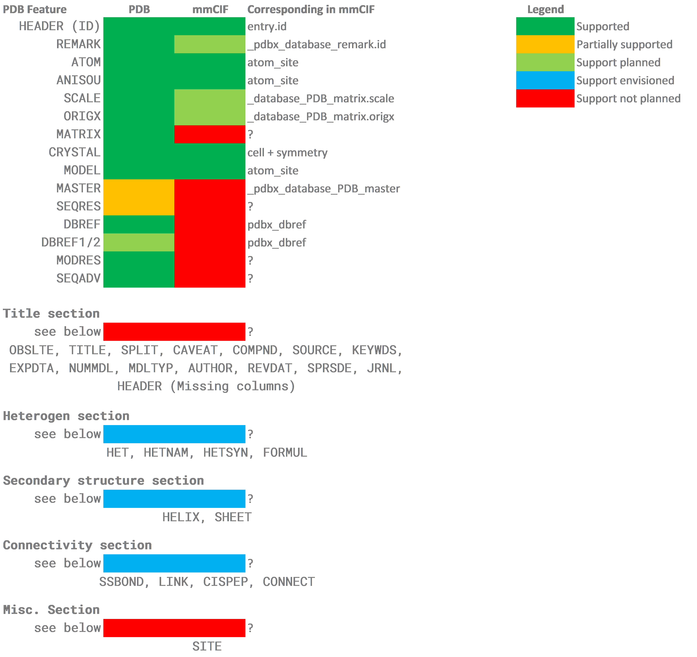

 
 

## Description
This is a Rust library helping to parse, edit and save crystallographic PDB/mmCIF files. It can read most atomic data from PDB/mmCIF files, some is missing but will be added over time. Its high level goal is to create a stable, efficient and easy to use interface to PDB/mmCIF files. 

## Contributing
As this is a library in active development, feel free to share your thoughts, ideas, hopes, and criticisms. Every comment will be read and discussed so that this library is as useful as possible for all users. Of course we all like a civilised discussion so please follow the community guidelines, but over all please be a civilised human being.

## License
MIT, just use it if you can use it. If you use it for something cool I would like to hear, but no obligations!

## Why
Just for fun, to play with fancy abstractions. But at the same time I think that using Rust in scientific computing would be really cool and this library would be needed if I were to be doing my internship in Rust. So by creating it I hope to extend the usability of Rust a little bit more. Since Nature published an [article](https://www.nature.com/articles/d41586-020-03382-2) (technology feature) which laid out the benefits of using Rust and showed that Rust is used more and more, recently I am planning on working more with Rust in scientific projects. And I think that the best way to help Rust move forward (in the scientific community) is by creating more support for scientific projects in Rust.

## Contributors
* Douwe Schulte
* [Tianyi Shi](https://github.com/TianyiShi2001)
* [DocKDE](https://github.com/DocKDE)

## Supported features
As the main goal of this library is to allow access to the atomical data many metadata features of both PDB and mmCIF are unsupported. For both file formats the most recent version (PDB v3.30 and mmcif v5.338) is used, but as both are quite stable file formats in the core atomical properties the exact version should not matter to end users.

The features where support is planned are planned to be included in the 1.0 release. The features where support is envisioned are candidates to be included, but not necessarily in the 1.0 release. The features which are planned are thought to be unnecessary for atomic data computations on theses files. If any of these are really needed for your use case please raise an issue then we can discuss its inclusion. Also if you need a feature that is 'planned' or 'envisioned' feel free to raise an issue to guide development to spots where it can make a real life impact.

## Latest update
### v0.6.3
* Added Anisotropic temperature factor support for mmCIF files
* Fixed an issue in the aniso matrix
* Added a `full_sort` function on PDB
* Fixed small bugs in the PDB saving logic

Also see [changelog](https://github.com/nonnominandus/pdbtbx/blob/master/changelog.md).
